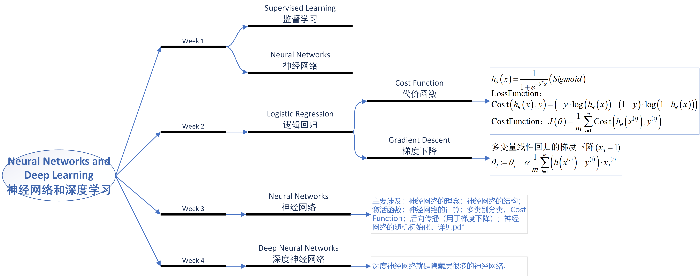
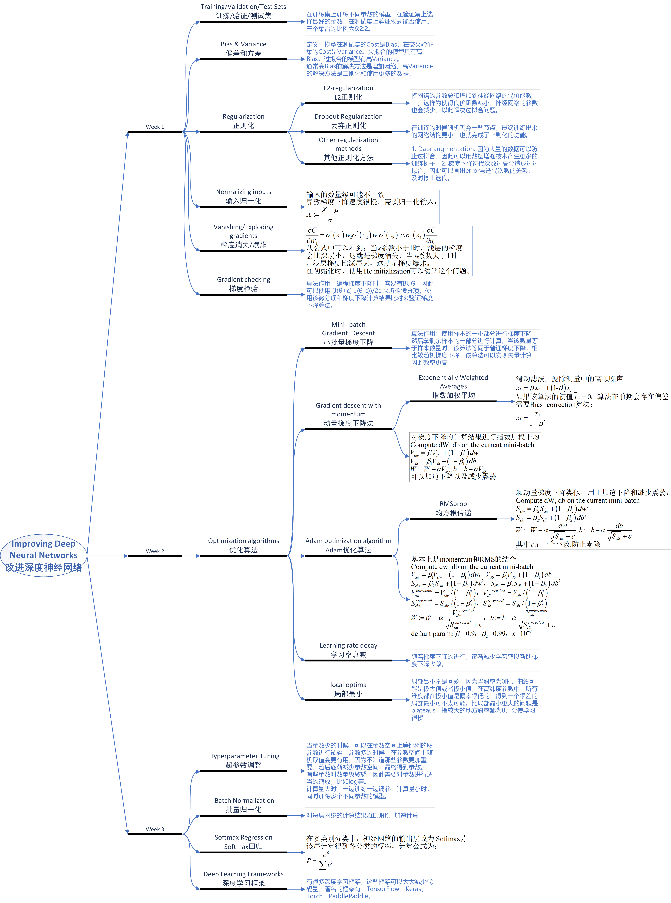
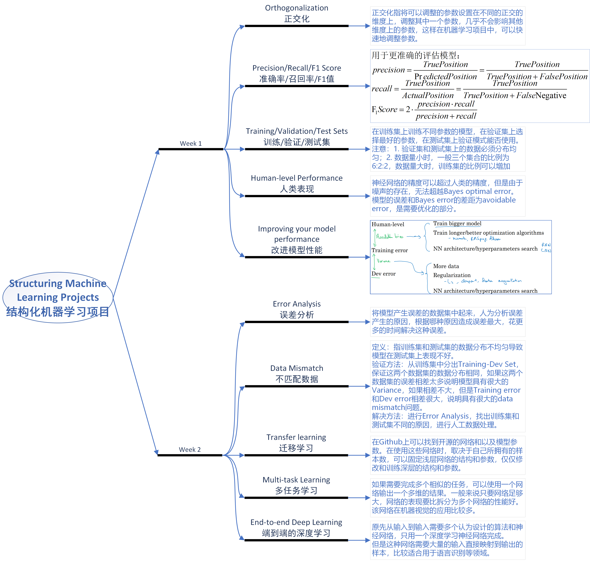
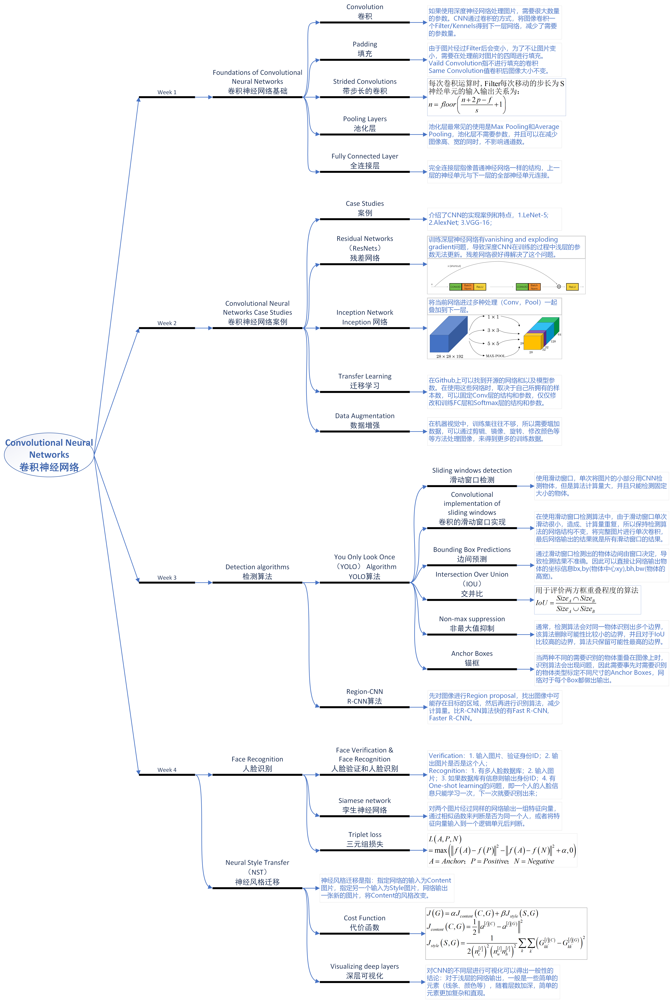

# [Andrew Ng深度学习网课](https://www.coursera.org/specializations/deep-learning)实验代码以及笔记

### Neural Networks and Deep Learning：

### Improving Deep Neural Networks：

### Structuring Machine Learning Projects：

### Convolutional Neural Networks：

### Sequence Models：

